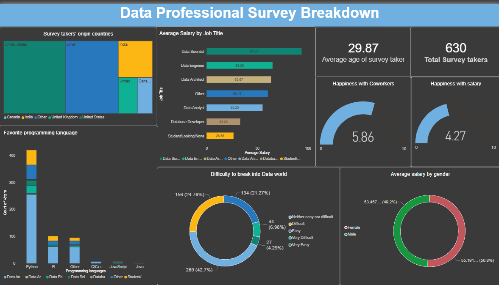
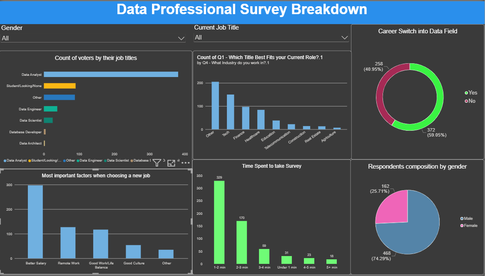

# Data Analyst Survey Dashboard
An interactive Power BI dashboard analyzing survey responses from data analysts and related professionals.

## Dashboard Preview
### Overview

### Career & Analysis

## Project Overview
This project was created to explore survey data from data analysts and related professionals.
The dashboard allows users to explore patterns across different respondent characteristics and survey responses using interactive visualizations and filters.

## Data Source & Inspiration
The dataset used in this project was provided by Alex The Analyst
through his YouTube channel.

This project was initially developed using the tutorial as a
learning reference. I initially followed some of the tutorial's workflow then extended the project by applying my own data preparation, calculations, additional slicers, visualizations, and analysis.

**Original Tutorial:**
[Power BI Full Project](https://youtu.be/I0vQ_VLZTWg?si=ArMML_G_cABKCRvg)

## Tools Used
- Power BI
- Power Query
- DAX

## Dataset
The dataset contains survey responses from data analysts and related professionals.
The data was provided in Excel format and imported into Power BI for cleaning, transformation, analysis, and visualization.

## Data Preparation
The dataset was cleaned and transformed using Power Query before being used in the Power BI report.
Key data preparation steps included:

- Handling missing values
- Correcting data types
- Transforming survey duration
- Creating calculated columns
- Creating categories for survey completion time
- Preparing data for visualization and analysis

## Data Analysis
The dashboard explores several aspects of the survey data, including:
- Respondent demographics
- Geographic distribution of respondents
- Programming language preferences
- Career transitions into the data field
- Survey completion time
- Other characteristics of survey respondents

## DAX
DAX was used to create measures and calculations for analyzing the survey data.
Examples include:

- Counting respondents
- Calculating percentages
- Creating calculated metrics used in dashboard visualizations

## Key Insights
The dashboard was used to identify patterns and trends in the survey responses.
Some Key findings include:

- Python was the most popular programming language among the respondents followed by R while Java was the least favourite.
- Data Scientists earned the highest average salary while database developers earn lower salary compared to other data professions.
- Average satisfaction rating for current salary from respondents was 4.27 out of 10 and most survey respondents answered better salary is the most important    factor when choosing a new job.
- Around 60% of respondents switched their career into data field.
- 21.27% of respondents said it was easy to break into data field.

## Project Files
- [Power BI report file](data-analyst-survey-project.pbix)
- [Dashboard Screenshots](screenshots/)
